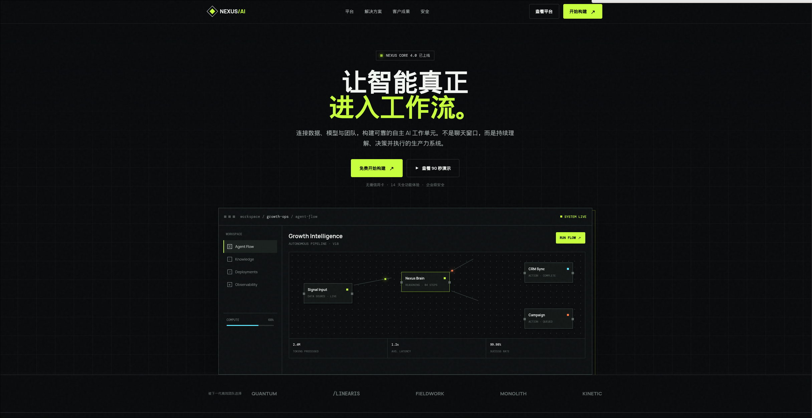
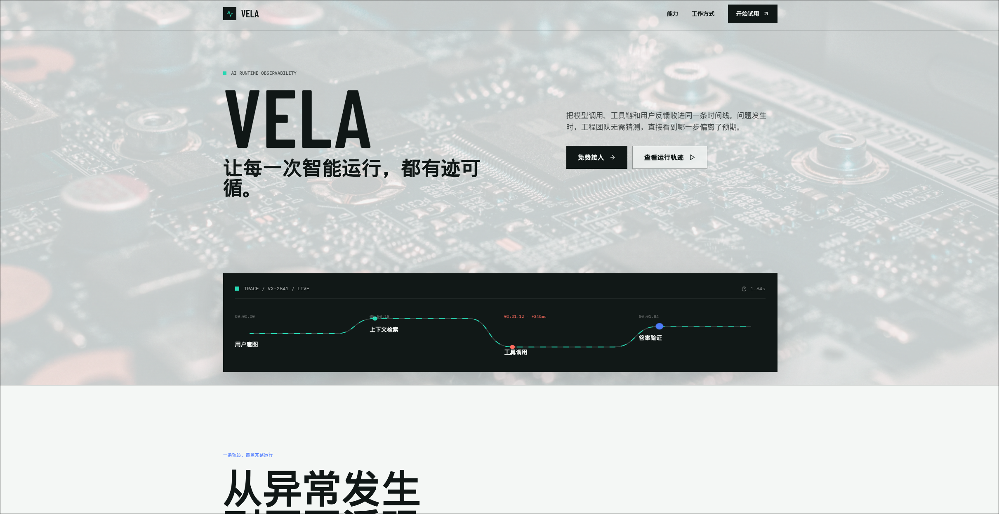

**"前端已死"**，这个口号喊了甚至十年甚至九年，追溯历史的话应该是在WordPress有的时候就开始喊了。这个口号在25年更是到了高潮，然后今年没人喊了，因为死人是不会说话的（绷）。所以大家都在用AI Vibe前端，老实说简单的Web应用和不在意客户的客户端完全可以一把梭，然后恭喜你你获得了一坨大份一样的前端（一些庆祝的音乐）

这里我们来尝试不使用任何Skill,来随便让AI生成一个富有科技感的产品介绍Landing Page，来盘点一下到底怎么slop，为什么slop，解决slop。这里只讨论网页设计层面如何，如果你认为前端设计无所谓那么文章就当个乐子和个人观点看就好
## example
>仅为个人观点，example由于篇幅限制只给出两个例子，可能论证并不严谨，很多是我在近期在前端时反复遇到的设计倾向

随便来个提示词吧
```
请写一个科技感产品介绍 Landing Page（HTML + Tailwind CSS 单文件）。要求视觉现代、排版有呼吸感，包含 Hero 区、核心功能网格和 CTA 区域。
```

(虽然这种Hero区和CTA区域相对来说比较slop,这里我们直接让它这么搞了，毕竟是个LandingPage)
使用GPT 5.6 Sol high, 感觉还可以吧？页面元素很丰富，重点突出，看起来像是一个有点科技感的.



当然这是用的前沿的模型，我们用相对廉价的 DeepseekV4Flash来尝试一下

哇嗷(电棍音)，好冲的味道。
## 总结slop特征
很明显我们的新模型已经会刻意的回避掉之前大火的垃圾设计了。但事实上，模型只会从一种slop转向另外一种slop
https://impeccable.style/slop/
impeccable（一个设计skill)这里给出了新老AI slop design的对比。简单总结一下，2022-2025的slop式设计有以下特征
- 紫蓝色渐变，会出现在按钮，标题，Icon，甚至背景中
- 深色页面配霓虹光晕，模糊色块，玻璃卡片（浅色页面下一般是蓝色）
- 按钮都是胶囊形，卡片都是`rounded-2xl`(固定的圆角)
- 很喜欢卡片套卡片，所有信息都需要一个div用border包起来，然后加上阴影
- 如果做了动画的话，元素都是淡入，上浮入场，Hover时发光并放大->动画并没有信息层面上的含义

一个比较好的例子->搭过/用过中转站的朋友都知道--Sub2API的前端

2026的新模型的一些特征是
- 背景使用网格--是网格背景，提示词的意思是网格布局...
- 背景大多是米黄色--很容易让人联想到A/的品牌语言
- 卡片没有消失--卡片式设计大行其道，只是从圆角变成了尖尖
- 会有很多神秘小字和微型英文标签
- 控制台拟态，会有节点，状态灯，扫描线，表演一种假的实时感

并不是说网格，直角，和微型的小字和标签是不好的设计，问题在于他们仅仅作为科技感的快捷符号被批量套用

暂时只总结出来这些

## 只要把审美和产品判断一起外包给 AI，Slop 就很难避免
模型终归是模型，当约束不足时，模型的输出会反复收敛到几个高概率设计簇。

模型吸收了对于上代设计的批判，逐渐内化了一套新的设计理念。避开了上代设计的弊端，这肯定是好的，问题是模型就是模型，模型避开了旧的错误模式，机械的反转了这些特征，又形成了新的AI风格--它比原本的风格更加克制可信，却仍缺少特征化区别。大家看久了仍然会产生审美疲劳（就像我看到米黄色背景就会ptsd)

只要还简单的认为AI已经能够完全取代前端与设计，只是用一句简单提示词糊出整个网页，那么最终得到的大概率还是模型的默认审美。聪明点的朋友可能会加入 frontend-design、Impeccable、awesome-design-md 等 Skills。不可否认，Skill能显著提高第一版的完成度，也能消除许多旧式AI视觉特征。但Skill也分种类的。很多Skills是直接规定什么字体高级、什么配色好看、页面应该采用什么结构。如果被用于所有项目，本质上只是把模型原来的默认风格替换成另一套默认风格，精致化了显眼的Slop

我们现在尝试加上frontend design Skill来进行（模型GPT 5.6 Sol High)

还是有不少问题的
- 神秘眉题 AI RUNTIME OBSERVABILITY；
- TRACE / VX-2841 / LIVE 式伪系统标签；
- 为了表现技术性而生成的假链路图；
- 尖角、紧凑间距和青绿色状态点。

所以这里说，你没有作出的设计决定和审美倾向，最终都会由模型的高概率默认值替你作出。单纯更换模型、Skill或harness不能解决这个问题

这里要指明的是，不同的模型审美是不同的，最新的GPT5.6的就如上面所讲, Kimi-K3是官方重点展示了截图闭环与前端可视化能力，强调视觉。最新的Claude5我没钱用也不想用，看榜单前端能力不如Kimi-K3就不评价了

哈哈，所以其实说不定多用点不同模型改改，杂糅出来的网站会没有那么slop呢？

## kill the slop
不是说就不用AI了，AI本质还是工具。真正有效的是改变设计决定的来源，让人负责方向，让工具负责表达、约束和实现。AI 可以负责生成代码、尝试方案、检查一致性和对照设计稿，但产品想表达什么、参考谁、什么信息最重要、为什么采用这种字体和布局，仍然需要有人给出答案。

ai产品如雨后春笋般冒出，多的像路边的皮卡丘了，偶尔点开几个官网看看，有的可能直接把我劝退--不是因为功能差，而是因为前端给我一种slop的感觉，进而延伸到考虑是不是整个应用是slop?产品快速落地的话功能实现是很重要的，但产品是给人用的，千万不能忽视人对于第一印象的评价。

笔者其实并没有学很多设计，只是会点开几个设计视频，看看UI是如何设计和排版，然后记不到脑子里。我也只是个臭写前端的，只会写点业务，懂点状态管理和性能优化，因为ai而对前端这个岗位的未来感到悲观。但品鉴过够多没有用心的前端后，我不禁真的会思考, 设计真的死了吗？前端真的死了吗？对我个人而言，有了ai后我的很多设计想法都能够快速落地和实现，我发现避免掉slop也并没有那么困难。

最近在玩海猫鸣泣之时，威尔有一句话是,“我不认可没有心的推理剧"。同样来说，前端设计也是需要有”心“的，没有心的前端终究是千篇一律，不会给人留下印象。设计可以从参考开始，但不能停在复制外观，好多网站并不会刻意的去尝试设计。

我推荐`open-design`这个项目（有钱用Claude Design也可以)，不是因为它能自动生成一种“不会Slop的风格”，而是因为它能帮助你把参考、产品性格和具体设计选择整理成一套Design Language。但是初稿仍然需要自己判断和修改，否则一键生成的Design Language同样可能只是另一套模型默认值。用这一套Design Language去生成的设计稿再不断的打磨，可以用Figma自己细调，也可以让AI反复迭代。最后/goal一下，帮我实现与设计稿像素级相同的前端，我觉得就可以了

总结一下我自己是如何去掉Slop
Before
- 找一个设计精美的其他网站作为具体参考，并说清楚参考它什么。
- 定义产品性格、信息密度、字体、颜色和形状语言。
- 最好脑子里有一个已经做好的稿子，写清楚真实所想内容--写不清楚也无所谓，慢慢用AI进行调整
After
- 删除无意义的的过度设计--就是上面所说的无法解释用途，也不能当作视觉优化元素的slop（当然，合适的设计需要保留）。
- 检查空状态、错误状态、长文本和手机端，而不只看首屏截图。

GPT老师说的好：Slop的反面不是更高级的默认风格，而是有人愿意为设计决定负责。

> 仅为个人观点