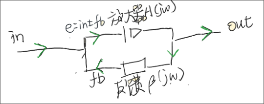

本文只为笔者简单学习得到的结果，用于一些场景的业务上的了解，如有错误或者偏差恳请指出

## 何为反馈

反馈，就是从输出端取回一部分信号，再送回输入端与原始输入进行比较

在负反馈系统中，反馈信号会从输入信号中减去。放大器真正放大的不是原始输入，而是两者相减后留下的误差信号。只要环路保持稳定，并且放大器的增益足够大，最终的闭环增益就主要由反馈网络决定，而不再过分依赖放大器自身的增益。至于为什么这样下面会推导的，现在先想着这回事情就好

用一张图来说明一下吧

明显我们有好多个量: $\mathrm{in}$ 是输入信号，$\mathrm{out}$ 是输出信号。输出经过反馈网络 $\beta(j\omega)$ 后得到反馈信号 $\mathrm{fb}$，并被送回求和点。求和点将输入和反馈相减，得到误差信号 $e$，误差信号 $e$ 随后进入放大器 $A(j\omega)$，产生输出 $\mathrm{out}$

嗯看样子我们加了这个反馈系统后解决了一个问题：放大器的放大倍数不好控制。但是凡是都是双刃剑，反馈系统有没有什么坏处呢？有：可能会产生自振荡。为什么会这样呢，我们先推导一下 $\mathrm{out}$ 与 $\mathrm{in}$ 之间的关系

## 闭环增益的推导

根据上面的图，我们可以直接写出下面三个关系：

$$
\begin{aligned}
e &= \mathrm{in}-\mathrm{fb} \\
\mathrm{fb} &= \beta\cdot\mathrm{out} \\
\mathrm{out} &= A\cdot e
\end{aligned}
$$

先把 $\mathrm{fb}=\beta\cdot\mathrm{out}$ 代入第一个式子：

$$
e=\mathrm{in}-\beta\cdot\mathrm{out}
$$

放大器放大的是误差信号 $e$，所以：

$$
\begin{aligned}
\mathrm{out}
&=A\cdot e \\
&=A(\mathrm{in}-\beta\cdot\mathrm{out}) \\
&=A\cdot\mathrm{in}-A\beta\cdot\mathrm{out}
\end{aligned}
$$

把带有 $\mathrm{out}$ 的部分放到等号左边：

$$
\begin{aligned}
\mathrm{out}+A\beta\cdot\mathrm{out} &= A\cdot\mathrm{in} \\
\mathrm{out}(1+A\beta) &= A\cdot\mathrm{in}
\end{aligned}
$$

然后两边同时除以 $\mathrm{in}$ 和 $(1+A\beta)$：

$$
\frac{\mathrm{out}}{\mathrm{in}}=\frac{A}{1+A\beta}
$$

这里的 $\mathrm{out}/\mathrm{in}$ 就是接入反馈以后的放大倍数，也就是闭环增益：

$$
A_{\mathrm{CL}}=\frac{A}{1+A\beta}
$$

如果放大器的增益 $A$ 足够大，使得 $\lvert A\beta\rvert\gg1$，那么分母里的 1 相比 $A\beta$ 就可以忽略：

$$
A_{\mathrm{CL}}\approx\frac{A}{A\beta}=\frac{1}{\beta}
$$

这样就能看出来，接入负反馈以后，整个电路的放大倍数主要由反馈网络 $\beta$ 决定，而不是由放大器本身的增益 $A$ 决定。所以反馈这就是为什么能够让放大倍数更加稳定

不过在这个公式中，$A$ 和 $\beta$ 不一定只是普通的实数。随着信号频率发生变化，它们的大小和相位也会发生变化。所以后面写得更完整一些应该是：

$$
A_{\mathrm{CL}}(j\omega)
=\frac{A(j\omega)}{1+A(j\omega)\beta(j\omega)}
$$

$A\beta$ 表示信号经过放大器和反馈网络以后产生的总变化。不过，一个信号真正绕环路一圈时还要经过求和点，而求和点会带来一个减号。这个减号不能漏掉，下面直接测一下就知道了

## 环路增益的测量

为了知道一个信号绕反馈环路一圈以后会变成什么样，我们先在反馈信号进入求和点之前把环路“断开”

当然了这里的“断开”只是为了方便分析。通常会保持直流反馈不变，只在交流上注入一个很小的测试信号。我们先用理想化的方法来分析

我们把原来的输入信号设为 0，然后从断口处放入一个测试信号，记作 $v_t$

测试信号进入求和点以后，求和点仍然会进行减法，因此：

$$
e=0-v_t=-v_t
$$

这个信号经过放大器 $A(j\omega)$ 后，输出变成：

$$
\mathrm{out}=A(j\omega)e=-A(j\omega)v_t
$$

输出再经过反馈网络 $\beta(j\omega)$，回到断口处的信号记作 $v_r$：

$$
v_r=\beta(j\omega)\mathrm{out}
$$

把放大器的输出代入：

$$
v_r=-A(j\omega)\beta(j\omega)v_t
$$

因此，绕一圈回来的信号与放进去的测试信号之比为：

$$
T(j\omega)
=\frac{v_r}{v_t}
=-A(j\omega)\beta(j\omega)
$$

这个 $T(j\omega)$ 就是环路增益。

把它代回上一节得到的闭环增益：

$$
A_{\mathrm{CL}}(j\omega)
=\frac{A(j\omega)}{1-T(j\omega)}
$$

这样一来，问题就显而易见了：如果在某个频率下 $T(j\omega)$ 恰好等于 1，那么闭环增益的分母就会变成 0。这会带来什么结果呢？

## 巴克豪森准则

闭环增益的分母为 0 需要

$$
T(j\omega)=1
$$

但是 $T(j\omega)$ 并不是一个普通的数，而是一个同时带有幅度和相位的复数。把它写成极坐标的形式：

$$
T(j\omega)
=\left|T(j\omega)\right|
\mathrm{e}^{j\angle T(j\omega)}
$$

想让 $T(j\omega)$ 真的等于 1，它的幅度和相位就必须同时满足：

$$
\left|T(j\omega)\right|=1
$$

$$
\angle T(j\omega)=360^\circ
$$

这两个条件就是巴克豪森准则。

这个结果放回上一节的测试过程就能理解了：从断口处放进去一个信号，如果它绕一圈回来以后大小没变，相位也没变，那么返回来的信号就和放进去的信号一模一样。这时候就算把外部的测试信号拿掉，信号也能在环路里一直循环下去，这就是振荡

如果 $\left|T(j\omega)\right|<1$，那么信号每绕一圈都会变小，最后消失。如果 $\left|T(j\omega)\right|>1$，信号就会每绕一圈变得更大。但是只有幅度满足条件还不够，回来的信号还必须和原来的信号同相，所以幅度和相位这两个条件必须在同一个频率下同时满足

当然实际电路的输出不会真的变成无穷大。振荡刚开始时，环路增益通常会稍微大于 1，信号的幅度会不断增大。等到放大器受到电源电压或者自身非线性的限制后，实际增益会慢慢降低，最后稳定在环路增益约等于 1 的状态

那如果我们有一个正常的反馈电路，我们要怎么测量它工作的时候有没有或会不会产生震荡呢？那就要用相位裕度来说明

## 相位裕度

我们知道产生振荡需要同时满足两个条件：

$$
\left|T(j\omega)\right|=1
$$

$$
\angle T(j\omega)=360^\circ
$$

但是这两个条件不一定会在同一个频率下同时满足。所以我们先找到环路增益大小刚好等于 1 的那个频率，并把它记作 $\omega_{\mathrm{gc}}$：

$$
\left|T(j\omega_{\mathrm{gc}})\right|=1
$$

这个频率叫作增益交越频率

在这个频率下，环路增益的大小已经满足了振荡的幅度条件，接下来就要看相位距离 $360^\circ$ 还有多远。这个差值就是相位裕度，记作 $\mathrm{PM}$：

$$
\mathrm{PM}
=360^\circ-\angle T(j\omega_{\mathrm{gc}})
$$

比如在增益交越频率下，信号绕环路一圈产生的总相位变化是 $300^\circ$，那么：

$$
\mathrm{PM}=360^\circ-300^\circ=60^\circ
$$

说明当前相位距离振荡条件还差 $60^\circ$

如果总相位变化已经达到 $360^\circ$：

$$
\mathrm{PM}=360^\circ-360^\circ=0^\circ
$$

这时候幅度条件和相位条件同时满足，电路正好处在振荡的临界状态

所以相位裕度越大，电路距离振荡条件越远；相位裕度越小，电路就越容易出现振铃甚至振荡。一般来说，相位裕度在 $45^\circ$ 到 $60^\circ$ 左右时，电路会比较稳定。如果相位裕度太小，即使电路还没有持续振荡，输出也可能出现明显的过冲和振铃

这里为什么一定要在 $\left|T\right|=1$ 的频率下看相位呢？因为振荡要求幅度和相位两个条件同时满足。脱离增益交越频率，只看某个频率下的相位是否接近 $360^\circ$ 并没有太大意义

## 相位的产生

那大家可能会有疑问：环路中的这些相位变化到底是从哪里产生的？我没有相位变化这件事不就会很完美的解决了吗？这只是理想情况下信号进入放大器以后，输出会立刻跟着输入发生变化。但是真实电路中存在电容和电感，它们都会储存能量，所以电路不可能在一瞬间完成响应。输出相对于输入会慢一些，就会造成一定的相位滞后

我们先看一个最简单的 RC 低通电路，它的传递函数为：

$$
H(j\omega)
=\frac{1}{1+j\omega RC}
$$

令：

$$
\omega_0=\frac{1}{RC}
$$

那么传递函数可以写成：

$$
H(j\omega)
=\frac{1}{1+j\omega/\omega_0}
$$

它的幅度为：

$$
\left|H(j\omega)\right|
=\frac{1}{\sqrt{1+\left(\omega/\omega_0\right)^2}}
$$

它的相位为：

$$
\angle H(j\omega)
=-\arctan\left(\frac{\omega}{\omega_0}\right)
$$

这里的负号就表示输出信号落后于输入信号。为了方便计算累计的相位滞后，我们把它滞后的大小记作 $\phi_H(\omega)$：

$$
\phi_H(\omega)
=\arctan\left(\frac{\omega}{\omega_0}\right)
$$

当频率很低时：

$$
\omega\ll\omega_0
$$

$$
\phi_H(\omega)\approx0^\circ
$$

这时候电容对电路的影响很小，输出基本可以跟上输入。

当频率刚好等于极点频率时：

$$
\omega=\omega_0
$$

$$
\phi_H(\omega_0)=45^\circ
$$

当频率越来越高时：

$$
\phi_H(\omega)\rightarrow90^\circ
$$

所以一个 RC 极点最多可以产生接近 $90^\circ$ 的相位滞后，不过只能不断接近，不能在有限频率下真正达到 $90^\circ$。真实的放大器里往往不只有一个极点。晶体管内部的寄生电容、级间电容和输出端的负载电容，都可能和电阻一起形成新的极点。

如果一个放大器中有两个极点，那么它的传递函数可以写成：

$$
A(j\omega)
=\frac{A_0}
{\left(1+j\omega/\omega_1\right)
\left(1+j\omega/\omega_2\right)}
$$

两个极点产生的相位滞后会直接相加：

$$
\phi_A(\omega)
=\arctan\left(\frac{\omega}{\omega_1}\right)
+\arctan\left(\frac{\omega}{\omega_2}\right)
$$

每个极点最多产生接近 $90^\circ$ 的相位滞后，所以两个极点加起来最多接近 $180^\circ$。如果反馈网络 $\beta(j\omega)$ 中也有电容或者电感，它产生的相位滞后也要继续加到环路中。

在本文使用的环路增益中，求和点的减号本身已经相当于 $180^\circ$ 的相位变化。所以信号绕环路一圈产生的总相位变化为：

$$
\angle T(j\omega)
=180^\circ+\phi_A(\omega)+\phi_\beta(\omega)
$$

低频时，放大器和反馈网络产生的相位滞后都很小，所以总相位变化会接近 $180^\circ$。随着频率升高，各个极点产生的相位滞后不断增加，总相位变化也会逐渐接近 $360^\circ$

在这个理想模型中，只有两个极点时，额外的相位滞后只能不断接近 $180^\circ$。但是当它真正接近 $180^\circ$ 时，放大器的增益通常已经下降得非常小，所以幅度条件和相位条件很难在同一个频率下同时满足，因而不会出现振荡。

但是当环路中出现三个或者更多极点时，总相位变化就可能在环路增益还没有降到 1 以下之前达到 $360^\circ$。这时候巴克豪森准则的两个条件就可能同时满足，电路也就有了产生振荡的可能。

所以相位并不是突然出现的，它把电路中电容、电感以及各种延迟产生的响应滞后不断累加，最后就可能把原本用来稳定电路的负反馈变成正反馈。

## 相位滞后所带来的影响——振荡

现在再回到最开始的求和点，它做的事情是：

$$
e=\mathrm{in}-\mathrm{fb}
$$

在频率比较低的时候，反馈信号可以及时回到求和点。输出变大，反馈信号也跟着变大，然后从输入中减去，让误差信号 $e$ 变小，这时候反馈确实在阻止输出继续变大

但是如果放大器和反馈网络又产生了额外的 $180^\circ$ 相位滞后，那么反馈信号回到求和点时就已经反相了。相位变化 $180^\circ$ 和乘以 $-1$ 是同一件事情：

$$
\mathrm{e}^{j180^\circ}=-1
$$

求和点本来就要对反馈信号做一次减法，所以这时候实际得到的是：

$$
-(-\mathrm{fb})=+\mathrm{fb}
$$

这样一来，原本应该减掉的反馈信号反而被加了回去。电路的连接方式没有变化，但是在这个频率下，负反馈已经变成了正反馈

从总相位变化来看，求和点的减号带来了 $180^\circ$，放大器和反馈网络又带来了额外的 $180^\circ$：

$$
180^\circ+180^\circ=360^\circ
$$

实际电路中本来就存在热噪声、电源纹等各种各样的很小的扰动，并不需要我们主动放入一个信号才能开始振荡。这些扰动中包含很多不同的频率，但是只有同时满足幅度条件和相位条件的那个频率会被不断放大，其他频率都会逐渐减小

so负反馈会产生振荡是因为相位滞后又带来了一个负号。两个负号相乘以后，原本用来减小误差的负反馈，就变成了不断放大误差的正反馈。

> 欢迎有相关知识的工程师拷打（（（
