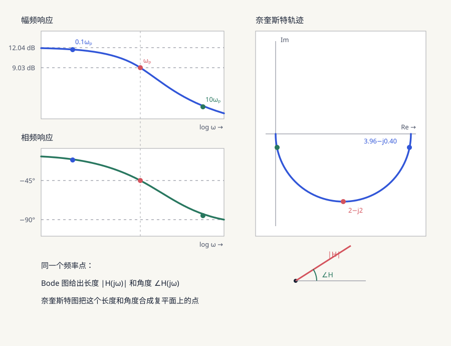
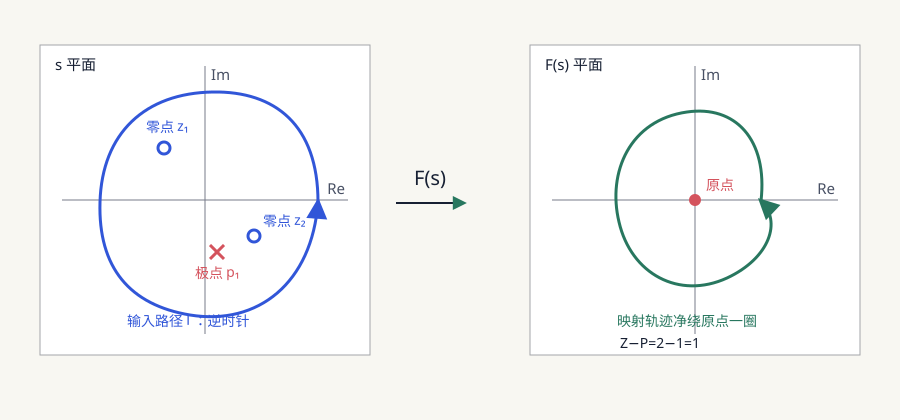
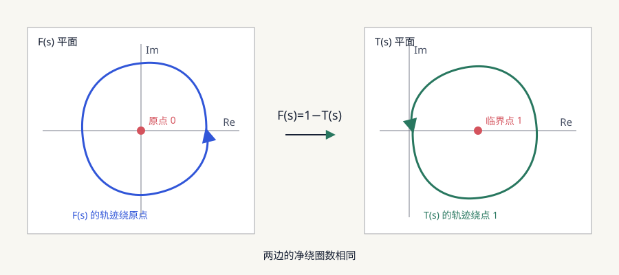

*本文只为笔者简单学习得到的结果，如有错误或者偏差恳请指出*

上一篇分析反馈振荡的时候，用到了 $H(j\omega)$、Bode 图和 Nyquist 图。当时是直接拿来用了，但是这几个东西到底是怎么从电路中算出来的，画出来的曲线又为什么能够判断系统稳不稳定呢？

所以这里单独记一下。为了不让中间突然出现一堆不知道从哪里来的定义，先固定看一个 RC 低通电路，然后沿着这个电路一点点往后推

## 先确定我们要算什么

RC 低通电路如下：

```text
vin ─── R ───●── vout
             │
             C
             │
            GND
```

现在给它输入一个角频率为 $\omega$ 的正弦信号：

$$
v_{\mathrm{in}}(t)
=V_{\mathrm{in}}\cos(\omega t)
$$

等刚接通信号时的暂态过程结束以后，输出仍然是相同频率的正弦信号，不过幅度和相位可能已经发生了变化：

$$
v_{\mathrm{out}}(t)
=V_{\mathrm{out}}\cos(\omega t+\varphi)
$$

所以我们现在想算的就是两件事情：

- 输出幅度 $V_{\mathrm{out}}$ 是输入幅度 $V_{\mathrm{in}}$ 的多少倍
- 输出相对输入产生了多少相位变化 $\varphi$

如果换一个输入频率，这两个结果一般也会跟着改变。**频率响应要记录的，就是电路在每一个频率下产生的幅度变化和相位变化**

但是这只是我们想要的结果，还没有说明应该怎么算。先从这个 RC 电路本身列方程

## 从电路方程开始

流过电阻的电流为：

$$
i_R(t)
=\frac{v_{\mathrm{in}}(t)-v_{\mathrm{out}}(t)}{R}
$$

流入电容的电流为：

$$
i_C(t)
=C\frac{\mathrm d v_{\mathrm{out}}(t)}{\mathrm dt}
$$

根据输出节点的电流关系：

$$
i_R(t)=i_C(t)
$$

所以：

$$
\frac{v_{\mathrm{in}}(t)-v_{\mathrm{out}}(t)}{R}
=C\frac{\mathrm d v_{\mathrm{out}}(t)}{\mathrm dt}
$$

整理一下：

$$
v_{\mathrm{in}}(t)
=v_{\mathrm{out}}(t)
+RC\frac{\mathrm d v_{\mathrm{out}}(t)}{\mathrm dt}
$$

现在问题出现了：输入和输出都是正弦信号，方程中却还有输出的导数。如果直接展开三角函数当然也可以算，但是过程很麻烦

我们希望找到一种表示方法，可以把求导变成普通的乘法。这个时候才需要用到复指数

## 为什么要使用 $e^{j\omega t}$

根据欧拉公式：

$$
e^{j\omega t}
=\cos(\omega t)+j\sin(\omega t)
$$

实际的余弦信号可以看成复指数的实部。所以计算时先把输入写成：

$$
v_{\mathrm{in}}(t)
=\operatorname{Re}\left\{
\underline V_{\mathrm{in}}e^{j\omega t}
\right\}
$$

这里的 $\underline V_{\mathrm{in}}$ 是输入的复数幅值。下划线只是为了提醒我们它是复数，可以同时记录幅度和相位

我们再把输出写成：

$$
v_{\mathrm{out}}(t)
=\operatorname{Re}\left\{
\underline V_{\mathrm{out}}e^{j\omega t}
\right\}
$$

这样写的关键不是为了让公式看起来复杂，而是复指数求导以后仍然是它自己：

$$
\frac{\mathrm d}{\mathrm dt}
\left(\underline V_{\mathrm{out}}e^{j\omega t}\right)
=j\omega\underline V_{\mathrm{out}}e^{j\omega t}
$$

原来的求导运算，现在变成了乘以 $j\omega$：

$$
\frac{\mathrm d}{\mathrm dt}
\quad\longrightarrow\quad
j\omega
$$

这就是正弦稳态分析中使用复数的原因。下面把它放回刚才的电路方程

## 从电路方程得到 $H(j\omega)$

刚才得到的电路方程为：

$$
v_{\mathrm{in}}(t)
=v_{\mathrm{out}}(t)
+RC\frac{\mathrm d v_{\mathrm{out}}(t)}{\mathrm dt}
$$

代入复指数形式：

$$
\underline V_{\mathrm{in}}e^{j\omega t}
=\underline V_{\mathrm{out}}e^{j\omega t}
+j\omega RC\underline V_{\mathrm{out}}e^{j\omega t}
$$

等式中的每一项都有 $e^{j\omega t}$，把它约掉：

$$
\underline V_{\mathrm{in}}
=\underline V_{\mathrm{out}}
+j\omega RC\underline V_{\mathrm{out}}
$$

把 $\underline V_{\mathrm{out}}$ 提出来：

$$
\underline V_{\mathrm{in}}
=\underline V_{\mathrm{out}}(1+j\omega RC)
$$

所以输出与输入的复数幅值之比为：

$$
\frac{\underline V_{\mathrm{out}}}
{\underline V_{\mathrm{in}}}
=\frac{1}{1+j\omega RC}
$$

我们把这个比值记作 $H(j\omega)$：

$$
\boxed{
H(j\omega)
:=\frac{\underline V_{\mathrm{out}}}
{\underline V_{\mathrm{in}}}
}
$$

所以这个 RC 低通的频率响应就是：

$$
\boxed{
H(j\omega)=\frac{1}{1+j\omega RC}
}
$$

$H(j\omega)$ 并不是突然定义出来的某个抽象函数。它就是在输入频率为 $\omega$ 时，输出和输入的复数幅值之比

因为复数幅值中同时保存了幅度和相位，所以这个比值也同时保存了电路带来的幅度变化和相位变化

## 从 $H(j\omega)$ 中拆出幅度和相位

现在已经得到了：

$$
H(j\omega)=\frac{1}{1+j\omega RC}
$$

接下来要从这个复数中，把一开始想要的幅度倍数和相位变化拆出来

令：

$$
x=\omega RC
$$

那么：

$$
H(j\omega)=\frac{1}{1+jx}
$$

分母 $1+jx$ 在复平面上的实部为 $1$，虚部为 $x$，所以它的模长为：

$$
|1+jx|
=\sqrt{1^2+x^2}
=\sqrt{1+x^2}
$$

它的相角为：

$$
\arg(1+jx)
=\arctan\left(\frac{x}{1}\right)
=\arctan(x)
$$

因为 $1+jx$ 位于分母，所以模长要取倒数，相角要取负号：

$$
|H(j\omega)|
=\frac{1}{\sqrt{1+x^2}}
$$

$$
\angle H(j\omega)
=-\arctan(x)
$$

把 $x=\omega RC$ 代回去：

$$
\boxed{
|H(j\omega)|
=\frac{1}{\sqrt{1+(\omega RC)^2}}
}
$$

$$
\boxed{
\angle H(j\omega)
=-\arctan(\omega RC)
}
$$

现在就能回答最开始的问题了。如果输入为：

$$
v_{\mathrm{in}}(t)
=V_{\mathrm{in}}\cos(\omega t)
$$

那么稳态输出为：

$$
\boxed{
v_{\mathrm{out}}(t)
=|H(j\omega)|V_{\mathrm{in}}
\cos\left(\omega t+\angle H(j\omega)\right)
}
$$

所以 $|H(j\omega)|$ 是输出与输入的幅度之比，$\angle H(j\omega)$ 是输出相对输入产生的相位变化。输出中的时间项仍然是 $\omega t$，所以电路没有产生新的频率

到这里，最开始提出的两个问题已经有答案了。但是我们现在只写出了公式，还没有看出频率改变时结果究竟怎么变化

## 改变频率会发生什么

令：

$$
\omega_0=\frac{1}{RC}
$$

那么频率响应可以写成：

$$
H(j\omega)
=\frac{1}{1+j\omega/\omega_0}
$$

$\omega_0$ 是这个 RC 电路的极点频率。为什么叫极点频率后面会从 $H(s)$ 中看到，现在先把几个不同的频率代进去：

| 频率 | $|H(j\omega)|$ | $\angle H(j\omega)$ |
| --- | ---: | ---: |
| $0.1\omega_0$ | $0.995$ | $-5.7^\circ$ |
| $\omega_0$ | $0.707$ | $-45^\circ$ |
| $10\omega_0$ | $0.0995$ | $-84.3^\circ$ |

频率较低时，输出的幅度和相位都和输入相差不大。频率升高以后，输出幅度不断减小，相位滞后不断增加

例如取：

$$
R=1\text{ k}\Omega
$$

$$
C=1\ \mu\text{F}
$$

那么：

$$
\omega_0
=\frac{1}{RC}
=1000\text{ rad/s}
$$

对应的普通频率为：

$$
f_0
=\frac{\omega_0}{2\pi}
\approx159\text{ Hz}
$$

当输入频率为大约 $159\text{ Hz}$ 时，输出幅度会变成输入的 $0.707$ 倍，同时滞后 $45^\circ$

我们当然可以继续用表格记录更多频率，但是频率点一多就很难看出整个变化趋势。所以接下来才需要把这些结果画成图

## 把扫频结果画出来

让 $\omega$ 从低频不断增加，并在每个频率下计算：

$$
|H(j\omega)|
$$

和：

$$
\angle H(j\omega)
$$

把幅度和相位分别对频率作图：

- 幅度随频率变化的图叫作**幅频图**
- 相位随频率变化的图叫作**相频图**
- 两张图放在一起就是 **Bode 图**

幅度通常会换算成分贝：

$$
G_{\mathrm{dB}}(\omega)
=20\log_{10}|H(j\omega)|
$$

例如在 $\omega=\omega_0$ 时：

$$
20\log_{10}(0.707)
\approx-3.01\text{ dB}
$$

还有另一种画法。对于每个频率，$H(j\omega)$ 本身就是一个复数，所以也可以直接把它画在复平面上。随着 $\omega$ 不断变化，这个点会形成一条轨迹，这就是 **Nyquist 图**



*图中相同颜色的点来自同一个频率*

所以 Bode 图和 Nyquist 图不是两组不同的数据：

```text
同一个 H(jω)
      ├──拆成 |H(jω)| 和 ∠H(jω) → Bode 图
      └──直接画在复平面上       → Nyquist 图
```

到这里，我们已经能够从电路算出频率响应，也能把它画出来。但是这只能说明外部输入一个正弦信号以后，输出会怎样变化

上一篇真正关心的是另一个问题：把外部输入撤掉以后，系统自身产生的扰动会衰减还是增长？这才是稳定性问题。只观察等幅正弦输入还不够，所以接下来要把 $j\omega$ 扩展成更一般的 $s$

## 从 $j\omega$ 扩展到 $s$

前面使用的信号形式为：

$$
e^{j\omega t}
$$

它只会等幅振荡。为了同时描述振荡以及幅度随时间增长或者衰减，把指数中的 $j\omega$ 扩展成：

$$
s=\sigma+j\omega
$$

那么：

$$
e^{st}
=e^{(\sigma+j\omega)t}
=e^{\sigma t}e^{j\omega t}
$$

其中：

- $e^{\sigma t}$ 决定幅度随时间增长还是衰减
- $e^{j\omega t}$ 决定信号以什么角频率振荡

| $s$ 的实部 | $e^{\sigma t}$ 的变化 | 对应位置 |
| --- | --- | --- |
| $\sigma<0$ | 随时间衰减 | $s$ 平面左半平面 |
| $\sigma=0$ | 保持不变 | $s$ 平面虚轴 |
| $\sigma>0$ | 随时间增长 | $s$ 平面右半平面 |

前面令输入和输出都含有 $e^{j\omega t}$ 时，求导相当于乘以 $j\omega$。现在换成 $e^{st}$，求导就相当于乘以 $s$：

$$
\frac{\mathrm d}{\mathrm dt}
\quad\longrightarrow\quad
s
$$

把它代入同一个 RC 电路方程：

$$
v_{\mathrm{in}}(t)
=v_{\mathrm{out}}(t)
+RC\frac{\mathrm d v_{\mathrm{out}}(t)}{\mathrm dt}
$$

可以得到：

$$
\underline V_{\mathrm{in}}
=\underline V_{\mathrm{out}}(1+sRC)
$$

于是：

$$
\boxed{
H(s)=\frac{1}{1+sRC}
}
$$

这个 $H(s)$ 就是传递函数。它描述的不再只是等幅正弦信号，而是一般的 $e^{st}$ 经过系统以后会怎样变化

当我们只关心正弦稳态时，令 $\sigma=0$，也就是：

$$
s=j\omega
$$

马上就能回到前面的频率响应：

$$
H(j\omega)
=H(s)\big|_{s=j\omega}
=\frac{1}{1+j\omega RC}
$$

所以它们的关系是：

```text
H(s)：描述整个 s 平面中的增长、衰减和振荡
  │
  └──只取 σ=0，也就是 s=jω
                     ↓
                  H(jω)：频率响应
```

现在 $H(s)$ 已经出现了，接下来就能说明前面一直提到的极点到底是什么，以及它为什么和稳定性有关

## 极点为什么决定稳定性

RC 低通的传递函数为：

$$
H(s)=\frac{1}{1+sRC}
$$

当分母等于 0 时：

$$
1+sRC=0
$$

解得：

$$
s=-\frac{1}{RC}
$$

在这个位置传递函数会趋向无穷大，所以：

$$
p=-\frac{1}{RC}
$$

就是 RC 低通的**极点**

这个极点不是只存在于纸面上的一个特殊数字。RC 电路在没有外部输入时，自身响应的形式为：

$$
v_{\mathrm{out}}(t)
=Ke^{-t/(RC)}
$$

指数中的 $-1/(RC)$ 正好就是极点。因为它位于左半平面，自然响应会不断衰减，所以这个 RC 电路是稳定的

一般来说：

- 极点位于左半平面，对应的自然响应会衰减
- 极点位于右半平面，对应的自然响应会增长
- 极点位于虚轴上，对应的自然响应不会衰减，系统处在稳定边界

所以判断一个系统是否稳定，最后要看它的右半平面内有没有极点

现在又出现了一个实际问题：高阶系统的分母可能很复杂，直接解出所有闭环极点并不方便。我们已经能通过扫频得到一条复平面轨迹，有没有办法直接从这条轨迹判断右半平面内有几个极点呢？

幅角原理就是用来完成这一步的

## 幅角原理为什么能够数零点和极点

先看一个一般的有理函数：

$$
F(s)
=K\frac{(s-z_1)(s-z_2)\cdots(s-z_m)}
{(s-p_1)(s-p_2)\cdots(s-p_n)}
$$

当 $s=z_i$ 时，分子变成 0，整个函数也变成 0，所以 $z_i$ 叫作**零点**

当 $s=p_i$ 时，分母变成 0，函数会趋向无穷大，所以 $p_i$ 叫作**极点**

现在让 $s$ 沿着一条逆时针闭合路径 $\Gamma$ 走一圈，再把路径上的每个 $s$ 代入 $F(s)$，就会在 $F(s)$ 平面得到另一条闭合轨迹

先只看一个零点：

$$
F(s)=s-z_0
$$

如果路径 $\Gamma$ 把 $z_0$ 包在里面，那么 $s-z_0$ 就是从 $z_0$ 指向路径上各点的向量。当 $s$ 沿路径逆时针走一圈时，这个向量也会绕原点逆时针转一圈：

$$
\Delta\arg(s-z_0)=360^\circ
$$

所以一个被包围的零点贡献 $+360^\circ$

再看一个极点：

$$
F(s)=\frac{1}{s-p_0}
$$

$s-p_0$ 原本也会增加 $360^\circ$，但是它位于分母。复数取倒数以后相角要取反，所以一个被包围的极点贡献 $-360^\circ$

如果路径内部一共有 $Z$ 个零点和 $P$ 个极点，那么 $F(s)$ 的总相角变化为：

$$
\boxed{
\Delta_\Gamma\arg F(s)
=360^\circ(Z-P)
}
$$

也就是说，$F(s)$ 的映射轨迹绕原点的净圈数为：

$$
\boxed{N=Z-P}
$$



*图中路径内有两个零点和一个极点，所以映射轨迹净绕原点一圈*

这里的逻辑是：

```text
s 平面中看不见路径内部有几个零点和极点
                    ↓
让闭合路径经过 F(s) 映射
                    ↓
每个零点贡献一圈，每个极点抵消一圈
                    ↓
数输出轨迹绕原点的净圈数，得到 Z-P
```

需要注意，路径不能刚好穿过 $F(s)$ 的零点或者极点，而且绕圈的正负必须和路径前进方向一起看。本文约定输入路径逆时针为正

有了这个工具，最后就可以回到反馈系统

## 把幅角原理接到反馈系统

上一篇使用的环路增益为：

$$
T(s)=-A(s)\beta(s)
$$

对应的闭环增益为：

$$
A_{\mathrm{CL}}(s)
=\frac{A(s)}{1-T(s)}
$$

闭环系统的极点出现在分母等于 0 的位置：

$$
1-T(s)=0
$$

令：

$$
F(s)=1-T(s)
$$

那么问题就完全接上了：

- $F(s)$ 的零点就是闭环系统的极点
- 闭环系统想要稳定，就要求 $F(s)$ 在右半平面内没有零点
- 幅角原理正好可以通过闭合轨迹算出右半平面内有几个零点

在 $s$ 平面上取一条沿右半平面边界闭合的 **Nyquist 围线**。它沿虚轴前进，再通过右半平面内的一个大半圆闭合，最后让半圆半径趋向无穷大。本文仍然约定这条围线沿逆时针方向前进

令：

- $P$ 是围线内 $F(s)$ 的极点数。在没有发生极零相消时，也就是开环系统位于右半平面的极点数
- $Z$ 是围线内 $F(s)$ 的零点数，也就是闭环系统位于右半平面的极点数
- $N$ 是 $F(s)$ 的轨迹逆时针绕原点的净圈数

根据幅角原理：

$$
N=Z-P
$$

所以：

$$
\boxed{Z=N+P}
$$

闭环系统稳定要求：

$$
Z=0
$$

例如开环系统没有右半平面极点，也就是 $P=0$，那么映射轨迹也不能绕原点，只有 $N=0$ 时闭环才稳定

## 为什么实际观察的是临界点 $1$

上面使用的是：

$$
F(s)=1-T(s)
$$

按照幅角原理，本来应该画 $F(s)$ 的轨迹，然后数它绕原点的圈数。但是工程上一般直接画环路增益 $T(s)$

因为：

$$
F(s)=0
\quad\Longleftrightarrow\quad
T(s)=1
$$

所以 $F(s)$ 的轨迹绕原点，等价于 $T(s)$ 的轨迹绕临界点 $1$



*$F(s)=1-T(s)$ 会把轨迹旋转并平移，但是净绕圈数不会发生变化*

这就是在本文使用的环路增益定义下，Nyquist 图需要观察临界点 $T=1$ 的原因

它和上一篇得到的巴克豪森临界条件也能接起来：

$$
|T(j\omega)|=1
$$

$$
\angle T(j\omega)=360^\circ
$$

这两个条件同时满足就表示 $T(j\omega)=1$，也就是 Nyquist 轨迹刚好经过临界点 $1$。此时：

$$
F(j\omega)=1-T(j\omega)=0
$$

闭环极点落在虚轴上，系统正好处在稳定和不稳定的边界

巴克豪森准则只检查有没有某一个频率刚好满足振荡条件，而 Nyquist 判据会观察一条完整的闭合轨迹，再结合开环右半平面极点数 $P$，计算闭环右半平面极点数 $Z$

## 最后再走一次整条路

```text
想知道 RC 对正弦信号做了什么
                ↓
列出 RC 电路的微分方程
                ↓
用 e^(jωt) 把求导变成乘以 jω
                ↓
解出输出与输入之比 H(jω)
                ↓
从 H(jω) 拆出幅度和相位
                ↓
改变 ω 得到扫频结果
                ↓
分开画得到 Bode 图，画在复平面得到 Nyquist 图
                ↓
但稳定性关心的是系统自身会衰减还是增长
                ↓
把 jω 扩展为 s=σ+jω，得到 H(s)
                ↓
H(s) 的极点决定自然响应是否增长
                ↓
高阶系统不方便直接求出所有闭环极点
                ↓
幅角原理通过轨迹绕圈数得到 Z-P
                ↓
令 F(s)=1-T(s)，F 的零点就是闭环极点
                ↓
观察 T(s) 绕临界点 1 的情况，判断闭环稳定性
```

这样一来，频率响应、Bode 图、Nyquist 图和幅角原理就不是几块突然拼在一起的知识。前一个工具解决不了的问题，才会引出后一个工具，最后才走到反馈系统的稳定性

> 欢迎有相关知识的工程师拷打（（（
