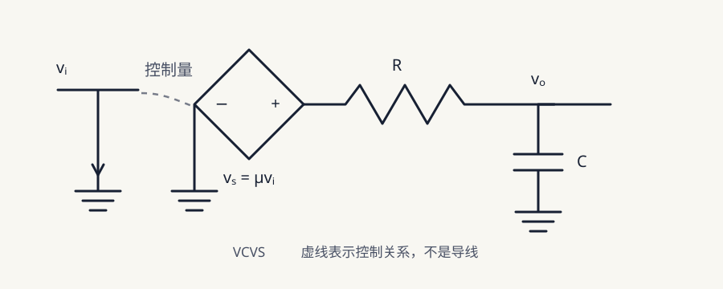
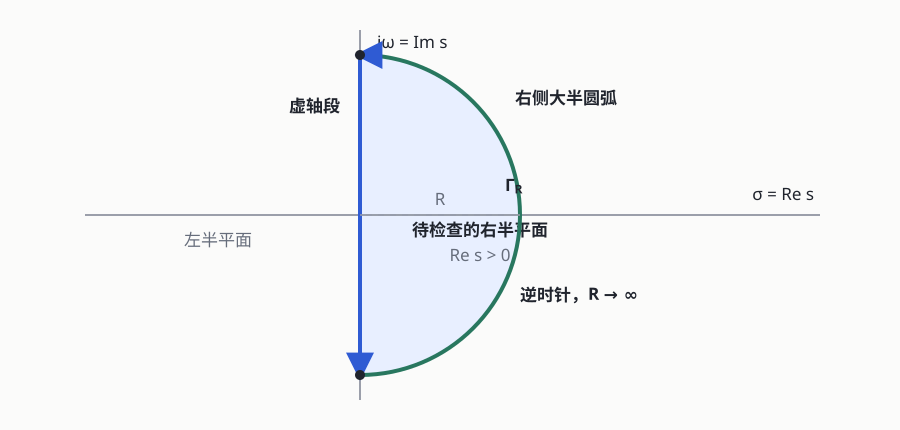
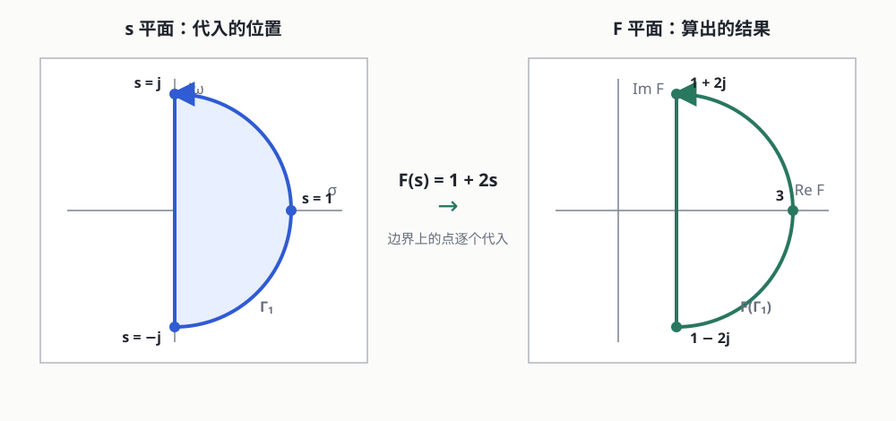
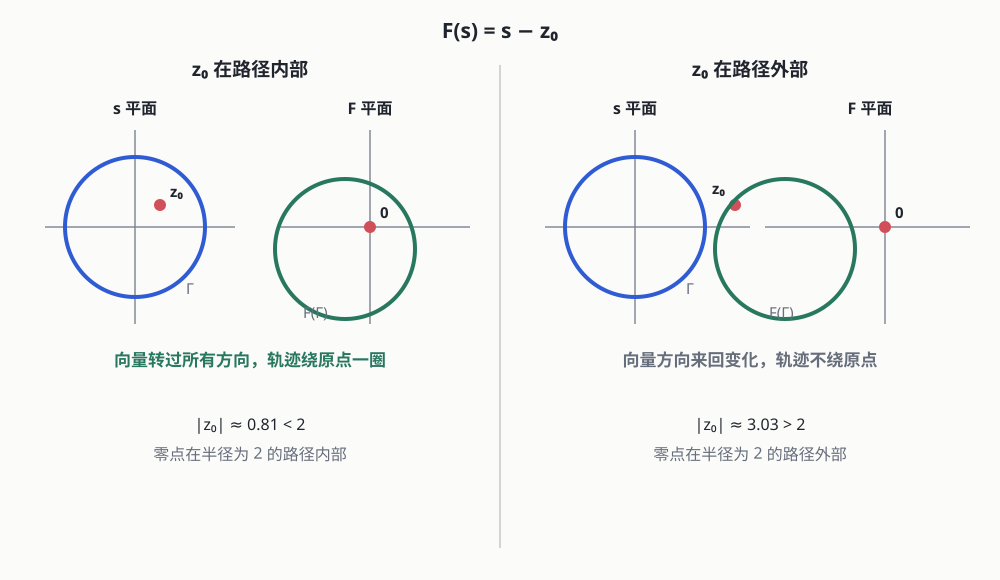

_本文只为笔者简单学习得到的结果，如有错误或者偏差恳请指出_

上一篇在分析反馈的时候其实应该还缺一些前置知识，虽然不妨碍理解反馈，但如果我们要深入理解整个系统，定量的分析，那么还需要去理解一下频率响应和幅角原理，以便来更好的分析吧

## 从有源 RC 得到频率响应

### VCVS 搭一个有源 RC

我们先用一个 **VCVS(电压控制电压源)**，把真实放大器的输出端简化成：

$$
v_s=\mu v_i
$$

$v_i$ 是输入端的小信号，负责控制输出；$v_s$ 是放大后的电压，$\mu$ 是电压增益。真实放大器还连接着独立电源，输出端送给负载的净能量就会来自这个电源。

现在我们让 VCVS 先把输入放大，再通过一个 RC 低通送到输出端：

我们来假设下面这组数值：

$$
\mu=4
$$

$$
R=2\,\mathrm{k}\Omega
$$

$$
C=0.5\,\mu\mathrm F
$$

暂时认为输出端没有连接其他负载，因此流过电阻的电流全部流入电容，所以：

$$
\frac{v_s(t)-v_o(t)}{R}
=C\frac{\mathrm d v_o(t)}{\mathrm dt}
$$

又因为受控源满足 $v_s(t)=\mu v_i(t)$，代入得到：

$$
\frac{\mu v_i(t)-v_o(t)}{R}
=C\frac{\mathrm d v_o(t)}{\mathrm dt}
$$

整理一下：

$$
\boxed{
\mu v_i(t)
=v_o(t)+RC\frac{\mathrm d v_o(t)}{\mathrm dt}
}
$$

### 正弦稳态

给这个电路输入一个角频率为 $\omega$ 的正弦信号：

$$
v_i(t)=V_i\cos(\omega t)
$$

这个电路由线性元件组成，而且元件参数不随时间改变，所以是一个**线性时不变**系统。刚接通信号时会有一段暂态过程，但等暂态结束以后，输出是相同频率的正弦信号，但是幅度和相位有可能已经改变，比如说：

$$
v_o(t)=V_o\cos(\omega t+\varphi)
$$

现在我们想知道的是：

- 输出幅度是输入幅度的多少倍
- 输出相对输入产生了多少相位变化

而且换一个输入频率以后，这两个结果也会改变。**频率响应记录的，就是系统在每一个频率下对输入信号造成的幅度变化和相位变化**

### 用复指数求出频率响应

刚才的电路方程中带有导数，直接展开三角函数也能算，但是会很麻烦。我们把正弦信号写成复指数形式，就能减少后续计算量：

$$
v_i(t)
=\operatorname{Re}\left\{
\underline V_i e^{j\omega t}
\right\}
$$

$$
v_o(t)
=\operatorname{Re}\left\{
\underline V_o e^{j\omega t}
\right\}
$$

$\underline V_i$ 和 $\underline V_o$ 是复数幅值。它们不只记录幅度，也把信号的相位一起记录了下来

复指数有一个很方便的性质：

$$
\frac{\mathrm d}{\mathrm dt}
\left(\underline V_o e^{j\omega t}\right)
=j\omega\underline V_o e^{j\omega t}
$$

也就是说，对正弦稳态信号求导，可以换成乘以 $j\omega$：

$$
\frac{\mathrm d}{\mathrm dt}
\quad\longrightarrow\quad
j\omega
$$

把它代回有源 RC 的方程：

$$
\mu\underline V_i e^{j\omega t}
=\underline V_o e^{j\omega t}
+j\omega RC\underline V_o e^{j\omega t}
$$

每一项中都有 $e^{j\omega t}$，约掉以后：

$$
\mu\underline V_i
=\underline V_o(1+j\omega RC)
$$

把输出和输入的复数幅值之比定义为 $H(j\omega)$：

$$
\boxed{
H(j\omega)
:=\frac{\underline V_o}{\underline V_i}
=\frac{\mu}{1+j\omega RC}
}
$$

$H(j\omega)$ 不是突然出现的抽象函数。它就是在输入频率为 $\omega$ 时，输出复数幅值和输入复数幅值的比值。因为复数幅值同时保存了幅度和相位，所以这个比值也同时保存了电路带来的幅度变化和相位变化

### 拆出幅度和相位

现在已经得到：

$$
H(j\omega)=\frac{\mu}{1+j\omega RC}
$$

本文中的 $\mu=4$，是一个相位为 $0^\circ$ 的正实数，所以它只改变幅度，不额外改变相位

分母 $1+j\omega RC$ 的模长为：

$$
\left|1+j\omega RC\right|
=\sqrt{1+(\omega RC)^2}
$$

相角为：

$$
\arg(1+j\omega RC)
=\arctan(\omega RC)
$$

分母的模长要取倒数，相角要取负号，所以：

$$
\boxed{
|H(j\omega)|
=\frac{\mu}{\sqrt{1+(\omega RC)^2}}
}
$$

$$
\boxed{
\angle H(j\omega)
=-\arctan(\omega RC)
}
$$

如果输入为：

$$
v_i(t)=V_i\cos(\omega t)
$$

那么稳态输出就是：

$$
\boxed{
v_o(t)
=|H(j\omega)|V_i
\cos\left(\omega t+\angle H(j\omega)\right)
}
$$

到这里，开头的两个问题都有答案了：$|H(j\omega)|$ 告诉我们幅度变成了多少倍，$\angle H(j\omega)$ 告诉我们相位移动了多少度。但是它们都会随着 $\omega$ 变化，所以还要看看换一个频率以后会得到什么结果

## 把频率响应画出来

为了少写一点，令：

$$
\omega_p=\frac{1}{RC}
$$

那么：

$$
H(j\omega)
=\frac{\mu}{1+j\omega/\omega_p}
$$

先算一下这里的 $RC$：

$$
RC
=2\times10^3\times0.5\times10^{-6}
=1\,\mathrm{ms}
$$

因此：

$$
\omega_p
=\frac{1}{RC}
=1000\,\mathrm{rad/s}
$$

换成普通频率：

$$
f_p
=\frac{\omega_p}{2\pi}
\approx159\,\mathrm{Hz}
$$

再把几个频率代进去：

| 频率 | $\lvert H(j\omega)\rvert$ | $\angle H(j\omega)$ |
| --- | ---: | ---: |
| $0.1\omega_p$ | $3.98$ | $-5.7^\circ$ |
| $\omega_p$ | $2.83$ | $-45^\circ$ |
| $10\omega_p$ | $0.398$ | $-84.3^\circ$ |

低频时，RC 几乎没有造成衰减，输出约为输入的 4 倍。在 $\omega=\omega_p$，也就是大约 $159\,\mathrm{Hz}$ 时，幅度变成 $2.83$ 倍，相位为 $-45^\circ$。频率继续升高以后，输出幅度不断减小，相位滞后也不断增加

这里只代入了三个频率点，还看不出完整的变化过程，我们最好用图表来描述一下

_图中相同颜色的点来自同一个频率_

## 从频率响应到稳定性

前面的 $H(j\omega)$ 记录的是输入一个等幅正弦信号以后，输出的幅度和相位怎么变化。但是要分析稳定性，我们更关心电路受到扰动以后，这个扰动会自己衰减，还是会越来越大。只用 $j\omega$ 还看不到这些，所以要把它再扩展一下

### 从 $j\omega$ 扩展到 $s$

前面使用的复指数是：

$$
e^{j\omega t}
$$

它只能表示等幅振荡。把 $j\omega$ 扩展成一个更一般的复数：

$$
s=\sigma+j\omega
$$

那么：

$$
e^{st}
=e^{(\sigma+j\omega)t}
=e^{\sigma t}e^{j\omega t}
$$

这里的 $e^{j\omega t}$ 仍然负责振荡，$e^{\sigma t}$ 负责改变振荡的幅度：

- $\sigma<0$ 时，幅度会不断衰减
- $\sigma=0$ 时，幅度保持不变
- $\sigma>0$ 时，幅度会不断增长

$s$ 的实部负责增长和衰减，虚部负责振荡，这个 $s$ 就叫作**复频率**

对于 $e^{st}$，求导会变成乘以 $s$：

$$
\frac{\mathrm d}{\mathrm dt}e^{st}
=se^{st}
$$

把它放回同一个有源 RC 的方程，就能得到：

$$
\boxed{
H(s)=\frac{\mu}{1+sRC}
}
$$

当我们只看等幅正弦信号时，令 $\sigma=0$，也就是令 $s=j\omega$：

$$
H(j\omega)
=H(s)\big|_{s=j\omega}
$$

所以 $H(j\omega)$ 其实就是 $H(s)$ 在虚轴上的那一部分

### 极点与自然响应

刚才得到的 $H(s)$，分母等于 $0$ 时：

$$
1+sRC=0
$$

$$
p=-\frac{1}{RC}
$$

让传递函数分母等于 $0$ 的位置叫作**极点**。前面已经算出 $RC=1\,\mathrm{ms}$，所以这里的极点为：

$$
p=-1000\,\mathrm{s}^{-1}
$$

这个 $-1000$ 还会直接出现在电路的自然响应里。把外部输入撤掉以后：

$$
v_o(t)=Ke^{-1000t}
$$

指数中的 $-1000$ 就是刚才算出来的极点。它位于 $s$ 平面的左半平面，对应的信号会随时间衰减，所以这个有源 RC 自身是稳定的

### 反馈稳定性到底要找什么

这里先别把 $H(s)$ 和后面的 $T(s)$ 混在一起。$H(s)$ 是这个有源 RC 从输入到输出的传递函数；接成反馈以后，信号绕环路一圈产生的变化记作：

$$
T(s)=-A(s)\beta(s)
$$

按照这里的符号约定，闭环增益为：

$$
A_{\mathrm{CL}}(s)
=\frac{A(s)}{1-T(s)}
$$

闭环极点出现在 $1-T(s)=0$ 的位置。为了少写一点，令：

$$
F(s)=1-T(s)
$$

这样问题就变成了：$F(s)$ 在右半平面内有没有零点，因为这些零点同时也是闭环系统的极点

比如说：

$$
T(s)=\frac{2}{s+1}
$$

那么：

$$
F(s)
=1-\frac{2}{s+1}
=\frac{s-1}{s+1}
$$

当 $s=1$ 时：

$$
F(1)=0
$$

所以闭环系统在右半平面有一个极点 $s=1$，对应的自然响应中会出现 $e^t$，它会不断增长，系统也就不稳定。

简单的函数可以直接解方程，但是函数复杂以后，把所有零点都直接解出来就很困难啊。所以接下来我们换一种办法：不直接计算路径内部的每一个点，看一圈边界经过函数以后变成了什么形状

## 幅角原理

### 先把右半平面围起来

想知道右半平面里有没有 $F(s)$ 的零点，先用一条闭合路径把它围起来。这条路径记作 $\Gamma_R$，由两部分组成：

$$
\Gamma_R
=\text{虚轴上的线段}
+\text{右侧的大半圆弧}
$$

右半平面和 $\Gamma_R$ 不是一个东西，前者是要检查的区域，后者只是区域的边界。图中先画一个有限半径 $R$，最后再让 $R\to\infty$。本文让 $\Gamma_R$ 逆时针前进，后面的绕圈正负也按照这个方向计算

### 边界经过函数映射

让 $s$ 沿着 $\Gamma_R$ 走一圈，再把边界上的每一个 $s$ 代入 $F(s)$。$s$ 画在 $s$ 平面中，算出来的 $F(s)$ 画在另一个 $F$ 平面中

比如先用一个很简单的函数：

$$
F(s)=1+2s
$$

并且暂时取 $R=1$。边界上的几个点经过函数以后会变成：

$$
s=j\quad\longmapsto\quad F(s)=1+2j
$$

$$
s=1\quad\longmapsto\quad F(s)=3
$$

$$
s=-j\quad\longmapsto\quad F(s)=1-2j
$$

这里只把边界上的点代入函数，不需要把内部的点全部算一遍。输入路径的起点和终点是同一个 $s$，得到的 $F(s)$ 当然也相同；只要函数在边界上连续，映射出来的轨迹就仍然闭合。接下来要看的，就是这条轨迹有没有绕原点

### 一个零点为什么会产生绕圈

先只看最简单的情况：

$$
F(s)=s-z_0
$$

当 $s=z_0$ 时，$F(s)=0$，所以 $z_0$ 是这个函数的零点。这里的 $s-z_0$ 也可以看成一根从 $z_0$ 指向 $s$ 的向量。

先不管刚才的半圆，把路径换成一个半径为 $2$ 的圆会更容易看：

$$
s=2e^{j\theta},
\qquad 0\le\theta\le2\pi
$$

如果零点为：

$$
z_0=0.7+j0.4
$$

那么：

$$
|z_0|
=\sqrt{0.7^2+0.4^2}
\approx0.81<2
$$

所以这个零点位于路径内部。这不是凭空假设它一定在里面，而是拿零点的位置和路径半径比较以后得到的结果。

当 $s$ 沿着圆走一圈时，从 $z_0$ 指向 $s$ 的向量会转过所有方向。又因为这个向量就是 $F(s)=s-z_0$，所以画到 $F$ 平面以后，轨迹也会绕原点一圈。

如果换成：

$$
z_0=3+j0.4
$$

那么：

$$
|z_0|
=\sqrt{3^2+0.4^2}
\approx3.03>2
$$

这个零点位于路径外部。从这个零点看向路径时，向量的方向只会来回变化，不会完整地转过所有方向，所以映射轨迹也不会绕原点一圈。

到这里，我们只说明了一个零点为什么会让映射轨迹绕原点。多个零点和极点一起出现以后应该怎么算?

### 多个零点和极点如何合在一起

其实就是把刚才的 $s-z_0$ 多写几次。一个有多个零点和极点的函数可以写成：

$$
F(s)
=K\frac{(s-z_1)(s-z_2)\cdots(s-z_m)}
{(s-p_1)(s-p_2)\cdots(s-p_n)}
$$

$z_1,z_2,\ldots$ 是零点，$p_1,p_2,\ldots$ 是极点。复数相乘时相角相加，相除时相角相减，所以：

$$
\arg F(s)
=\arg K
+\sum_i\arg(s-z_i)
-\sum_i\arg(s-p_i)
$$

当 $s$ 沿着逆时针闭合路径 $\Gamma$ 走一圈时，路径内部的每一个零点都会贡献 $360^\circ$，外部的零点净变化为 $0$。极点在分母上，所以内部的每一个极点会减掉 $360^\circ$。常数 $K$ 不会随 $s$ 变化，自然也不会贡献什么

假设路径内部一共有 $Z$ 个零点和 $P$ 个极点，那么：

$$
\boxed{
\Delta_\Gamma\arg F(s)
=360^\circ(Z-P)
}
$$

把映射轨迹逆时针绕原点的净圈数记作 $N$：

$$
\boxed{N=Z-P}
$$

图中的输入路径包住了两个零点和一个极点，所以：

$$
N=Z-P=2-1=1
$$

映射轨迹也就净绕原点一圈。这个结论就是**幅角原理**，数一下边界映射以后绕了几圈，就能得到路径内部的零点数和极点数相差多少

这里有一个前提，路径不能刚好穿过 $F(s)$ 的零点或者极点，否则函数值会变成 $0$ 或者无穷大，绕圈数也就没法正常计算

## 回到反馈系统

### 数出闭环极点

前面费了这么大劲去数函数的零点，最后还是为了把它接回反馈系统。回到前面定义的 $F(s)=1-T(s)$：

因为 $F(s)=0$ 就会让闭环传递函数的分母等于 $0$，所以 $F(s)$ 在右半平面的零点数 $Z$，就是闭环系统在右半平面的极点数。$F(s)$ 的极点数记作 $P$，一般也就是开环系统原本的右半平面极点数

再把 $F(\Gamma_R)$ 逆时针绕原点的净圈数记作 $N$。根据刚才的幅角原理：

$$
N=Z-P
$$

所以：

$$
\boxed{Z=N+P}
$$

闭环稳定就要求右半平面没有闭环极点，也就是 $Z=0$。所以我们不需要先把所有闭环极点解出来。开环原本有几个右半平面极点可以得到 $P$，映射轨迹的绕圈情况可以得到 $N$，最后用 $Z=N+P$ 就能知道闭环右半平面还有几个极点

### 为什么奈奎斯特图看点 $1$

按前面的推导，本来应该画 $F(s)=1-T(s)$，再观察它绕原点几圈。但是实际分析时一般直接画 $T(s)$。把关系式展开：

$$
F(s)=0
\quad\Longleftrightarrow\quad
1-T(s)=0
\quad\Longleftrightarrow\quad
T(s)=1
$$

$F(s)$ 平面的原点正好对应 $T(s)$ 平面的点 $1$

$$
F(s)=1-T(s)=-(T(s)-1)
$$

负号只会把整条轨迹旋转 $180^\circ$，不会改变绕圈方向和圈数。所以 $F(s)$ 绕原点几圈，就等价于 $T(s)$ 绕点 $1$ 几圈

本文使用的是 $T(s)=-A(s)\beta(s)$，因此这里的临界点是 $1$，不是 $-1$

### 完整的奈奎斯特轨迹

这里还有最后一个问题：前面学到的频率响应只是在虚轴上取 $s=j\omega$，但是 $\Gamma_R$ 除了虚轴以外，还有右侧的大半圆弧

虚轴这一段经过 $T(s)$ 映射以后，就是扫频得到的 $T(j\omega)$。对于实系数系统：

$$
T(-j\omega)=T(j\omega)^*
$$

所以负频率部分可以直接由正频率轨迹关于实轴镜像得到

至于右边的大半圆弧，如果环路增益的分子次数低于分母次数，那么当 $|s|\to\infty$ 时：

$$
T(s)\to0
$$

这部分经过映射以后会缩到原点附近。正频率、负频率和这段大半圆弧合在一起，才是稳定性判断真正使用的完整奈奎斯特轨迹，而不是随便找一个 $H(j\omega)$ 画出来就可以判断反馈稳不稳定

### 奈奎斯特判据

现在 $N$ 可以直接看 $T(s)$ 的奈奎斯特轨迹绕点 $1$ 的净圈数，仍然约定逆时针为正。闭环稳定要求 $Z=0$，代入前面的 $Z=N+P$：

$$
\boxed{N=-P}
$$

比如开环没有右半平面极点，$P=0$，那轨迹就不能净绕点 $1$。如果开环有一个右半平面极点，$P=1$，就需要 $N=-1$，也就是顺时针净绕点 $1$ 一圈

上一篇使用的振荡临界条件是：

$$
|T(j\omega)|=1
$$

$$
\angle T(j\omega)=360^\circ
$$

两个条件同时满足就是：

$$
T(j\omega)=1
$$

也就是轨迹刚好经过点 $1$。此时：

$$
F(j\omega)=1-T(j\omega)=0
$$

闭环极点刚好落在虚轴上，系统处于稳定和不稳定的边界

这两个东西不能混在一起：碰到点 $1$ 只说明到了稳定边界；到底稳不稳定，还是要看轨迹净绕了几圈，再代入 $Z=N+P$
