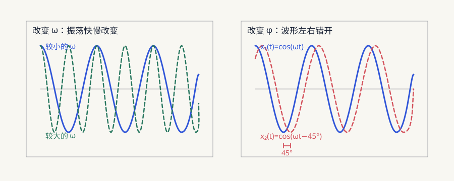

*本文只为笔者简单学习得到的结果，如有错误或者偏差恳请指出*

上一篇分析反馈振荡的时候，用到了 $H(j\omega)$、幅频响应、相频响应和 Nyquist 图。当时是直接拿来用了，但是这些东西到底表示什么，为什么一条画在复平面上的曲线又能用来判断系统稳不稳定呢？

所以这里单独记一下频率响应和幅角原理。先从一个普通的正弦信号开始，然后一点点接到反馈系统的稳定性上

## 正弦信号中的频率和相角

一个正弦信号可以写成：

$$
x(t)=X\cos(\omega t+\varphi)
$$

这里有三个量：

- $X$ 是信号的幅度，也就是波形有多高
- $\omega$ 是角频率，决定信号振荡得有多快
- $\varphi$ 是初相角，表示 $t=0$ 时信号已经走到了周期中的什么位置

我们平时说一个信号是 $50\text{ Hz}$，这里的 $50\text{ Hz}$ 是频率 $f$，表示信号一秒振荡 50 次。角频率 $\omega$ 和它描述的是同一件事情，只不过使用的单位不一样：

$$
\omega=2\pi f
$$

因为一个周期就是一整圈，也就是 $2\pi$ 弧度。所以一个 $1\text{ Hz}$ 的信号对应：

$$
\omega=2\pi\text{ rad/s}
$$

一个 $50\text{ Hz}$ 的信号对应：

$$
\omega=2\pi\times50=100\pi\text{ rad/s}
$$

如果用 $T_0$ 表示信号完成一个周期需要的时间，那么：

$$
T_0=\frac{1}{f}=\frac{2\pi}{\omega}
$$

所以 $f$、$\omega$ 和 $T_0$ 都是在描述信号振荡得有多快

那相角又是什么呢？我们来看两个频率相同的信号：

$$
\begin{aligned}
x_1(t)&=\cos(\omega t) \\
x_2(t)&=\cos(\omega t-45^\circ)
\end{aligned}
$$

它们振荡的速度完全一样，但是 $x_2(t)$ 要晚一点到达波峰，这就是 $x_2$ **滞后** $x_1$。一整个周期是 $360^\circ$，所以滞后 $45^\circ$ 就相当于晚了八分之一个周期：

$$
\Delta t=\frac{45^\circ}{360^\circ}T_0=\frac{T_0}{8}
$$

如果式子里是 $+45^\circ$，那么它就是**超前** $45^\circ$



*角频率改变波形振荡的快慢，相角改变波形在时间上的位置*

现在我们已经知道可以用幅度、频率和相角来描述一个正弦信号。那这个信号经过一个电路以后，会发生什么变化呢？

## 电路会对正弦信号做什么

我们给一个线性时不变系统输入：

$$
x(t)=X\cos(\omega t)
$$

**线性时不变系统**简单来说，就是这个系统本身的参数不会随着时间突然变化，而且输入放大几倍，输出也会按照相同的比例发生变化。由电阻、电容和电感组成的小信号电路，通常都可以这样分析

刚接通信号的时候，电容和电感原来储存的能量会让输出经历一小段变化，这一段叫作**暂态过程**。等暂态过程结束以后，输出仍然是一个频率为 $\omega$ 的正弦信号：

$$
y(t)=Y\cos(\omega t+\varphi)
$$

它的频率没有变化，但是幅度从 $X$ 变成了 $Y$，相位也多出了一个 $\varphi$

也就是说，对于一个固定频率的正弦信号，电路主要做了两件事情：

- 输入幅度 $X$ 变成了输出幅度 $Y$
- 输出相对输入多了一个相角 $\varphi$

那我们就需要一个量，可以把幅度变化和相位变化一起记录下来。这个量就是频率响应

## 频率响应的数学表示

如果直接使用三角函数计算，每经过一级电路都要重新展开一次，会很麻烦。复数乘法刚好可以同时表示长度缩放和角度旋转，所以这里会使用复数表示正弦信号

根据欧拉公式：

$$
e^{j\theta}=\cos\theta+j\sin\theta
$$

这里的 $j$ 是虚数单位，满足：

$$
j^2=-1
$$

正弦信号可以先写成复数形式，最后再取实部：

$$
x(t)=\operatorname{Re}\left\{Xe^{j\omega t}\right\}
$$

假设电路在角频率 $\omega$ 下产生的幅度和相位变化为：

$$
H(j\omega)
=\left|H(j\omega)\right|
e^{j\angle H(j\omega)}
$$

把输入信号乘上它：

$$
\begin{aligned}
H(j\omega)Xe^{j\omega t}
&=\left|H(j\omega)\right|e^{j\angle H(j\omega)}Xe^{j\omega t} \\
&=\left|H(j\omega)\right|X e^{j\left(\omega t+\angle H(j\omega)\right)}
\end{aligned}
$$

最后取实部，输出就是：

$$
y(t)=\left|H(j\omega)\right|X\cos\left(\omega t+\angle H(j\omega)\right)
$$

现在就可以看出来：

- $\left|H(j\omega)\right|$ 表示幅度变成了原来的多少倍
- $\angle H(j\omega)$ 表示输出相对输入产生了多少相位变化

这个 $H(j\omega)$ 就是**频率响应**

例如某个电路在一个频率下有：

$$
H(j\omega)=2e^{-j30^\circ}
$$

输入为：

$$
x(t)=0.5\cos(\omega t)
$$

那么输出为：

$$
\begin{aligned}
y(t)&=2\times0.5\cos(\omega t-30^\circ) \\
&=\cos(\omega t-30^\circ)
\end{aligned}
$$

也就是电路把输入幅度从 $0.5$ 放大到了 $1$，同时让输出滞后了 $30^\circ$

但是这里还有一个问题：为什么频率响应偏偏要写成 $H(j\omega)$，这个 $j\omega$ 又是从哪里来的呢？

## 为什么要写成 $H(j\omega)$

一个系统完整的传递函数通常写成：

$$
H(s)=\frac{Y(s)}{X(s)}
$$

**传递函数**就是在零初始条件下，用来描述系统输入和输出关系的函数。这里的 $X(s)$ 和 $Y(s)$ 是输入和输出经过拉普拉斯变换后的结果。拉普拉斯变换先不展开，只看这个 $s$：

$$
s=\sigma+j\omega
$$

把 $s$ 放进指数函数：

$$
e^{st}=e^{(\sigma+j\omega)t}=e^{\sigma t}e^{j\omega t}
$$

$e^{\sigma t}$ 决定信号会不会随着时间增长或者衰减，$e^{j\omega t}$ 决定信号以什么频率振荡

- 当 $\sigma<0$ 时，$e^{\sigma t}$ 会逐渐衰减，对应 $s$ 平面的左半平面
- 当 $\sigma>0$ 时，$e^{\sigma t}$ 会不断增长，对应右半平面
- 当 $\sigma=0$ 时，信号不会额外增长或者衰减，只剩下等幅振荡

频率响应研究的是电路面对一个持续振荡的正弦信号时会做什么，所以令：

$$
\sigma=0
$$

于是：

$$
s=j\omega
$$

把 $s=j\omega$ 代入传递函数 $H(s)$，得到的就是频率响应 $H(j\omega)$。所以频率响应其实就是传递函数在 $s$ 平面虚轴上的结果

*这里讨论的是正弦稳态，而且系统在虚轴上不能有未处理的极点。频率响应只是 $H(s)$ 在虚轴上的信息，并不是完整的 $s$ 平面。后面要判断系统稳定性，还需要知道右半平面内有没有极点*

定义有了，但是只看公式还是有点抽象。下面直接拿一个 RC 低通电路算一次

## RC 低通的频率响应

RC 低通电路如下：

```text
vin ─── R ───●── vout
             │
             C
             │
            GND
```

电容的阻抗是：

$$
Z_C=\frac{1}{j\omega C}
$$

阻抗可以先理解成元件对交流信号产生的阻碍。从这个式子可以看出来，频率 $\omega$ 越高，电容阻抗的大小就越小。高频信号会更容易经过电容流向地，所以输出会变小

根据分压关系：

$$
H(j\omega)=\frac{v_{\mathrm{out}}}{v_{\mathrm{in}}}=\frac{Z_C}{R+Z_C}
$$

把电容阻抗代进去：

$$
H(j\omega)=\frac{\frac{1}{j\omega C}}{R+\frac{1}{j\omega C}}
$$

分子分母同时乘以 $j\omega C$：

$$
H(j\omega)=\frac{1}{1+j\omega RC}
$$

令：

$$
\omega_0=\frac{1}{RC}
$$

于是：

$$
H(j\omega)=\frac{1}{1+j\omega/\omega_0}
$$

$\omega_0$ 叫作这个电路的**极点频率**。极点后面再说，现在先把它理解成电路开始明显衰减信号的位置

分母的模长为：

$$
\left|1+j\frac{\omega}{\omega_0}\right|=\sqrt{1+\left(\frac{\omega}{\omega_0}\right)^2}
$$

所以频率响应的幅度为：

$$
\left|H(j\omega)\right|=\frac{1}{\sqrt{1+\left(\omega/\omega_0\right)^2}}
$$

分母的相角是 $\arctan(\omega/\omega_0)$。它位于分母，所以频率响应的相角要取负号：

$$
\angle H(j\omega)=-\arctan\left(\frac{\omega}{\omega_0}\right)
$$

代入几个频率看看：

| 频率 | $\left|H(j\omega)\right|$ | $\angle H(j\omega)$ |
| --- | ---: | ---: |
| $0.1\omega_0$ | $0.995$ | $-5.7^\circ$ |
| $\omega_0$ | $0.707$ | $-45^\circ$ |
| $10\omega_0$ | $0.0995$ | $-84.3^\circ$ |

频率越高，输出幅度越小，相位滞后也越大。一个 RC 极点最多产生接近 $90^\circ$ 的相位滞后，但是在有限频率下不会真的达到 $90^\circ$

再代一组实际的数。取：

$$
R=1\text{ k}\Omega
$$

$$
C=1\ \mu\text{F}
$$

那么：

$$
\omega_0=\frac{1}{RC}=1000\text{ rad/s}
$$

把角频率换成普通频率：

$$
f_0=\frac{\omega_0}{2\pi}\approx159\text{ Hz}
$$

也就是说，当输入频率到达大约 $159\text{ Hz}$ 时，输出幅度会降到输入的 $0.707$ 倍，同时滞后 $45^\circ$

现在幅度和相位都算出来了，接下来只需要把它们画出来

## Bode 图和 Nyquist 图

第一种画法是把幅度和相位分开：

- 幅度随频率变化的图叫**幅频图**
- 相位随频率变化的图叫**相频图**
- 两张图放在一起就是 **Bode 图**

幅度通常会换算成分贝：

$$
G_{\mathrm{dB}}(\omega)=20\log_{10}\left|H(j\omega)\right|
$$

例如在 $\omega=\omega_0$ 时：

$$
20\log_{10}(0.707)\approx-3.01\text{ dB}
$$

第二种画法是不把复数拆开，而是直接把每一个频率对应的 $H(j\omega)$ 画在复平面上。随着 $\omega$ 不断变化，这些点会连成一条轨迹，这就是 **Nyquist 图**


*图中相同颜色的点表示同一个频率*

所以 Bode 图和 Nyquist 图画的其实是同一个东西。对于一个固定频率：

$$
H(j\omega)=\left|H(j\omega)\right|e^{j\angle H(j\omega)}
$$

Bode 图把它拆成长度 $\left|H(j\omega)\right|$ 和角度 $\angle H(j\omega)$ 分别画出来，Nyquist 图则直接把这个复数点画出来

上图为了看清楚 RC 低通的变化，只画了 $\omega\geq0$ 的部分。对于元件参数为实数的电路，负频率部分满足：

$$
H(-j\omega)=H^*(j\omega)
$$

右边的星号表示复共轭，也就是实部不变、虚部反号。所以负频率的轨迹是正频率轨迹关于实轴的镜像。真正使用 Nyquist 图判断稳定性的时候，需要的是一条完整的闭合轨迹，而不是图中的这一半

但是现在我们只是画出了一条曲线，它为什么能够判断系统内部有没有不稳定的极点呢？这里就需要幅角原理了

## 零点和极点

在讲幅角原理之前，先看一下什么是零点和极点

一个有理函数可以写成：

$$
F(s)=K\frac{(s-z_1)(s-z_2)\cdots(s-z_m)}{(s-p_1)(s-p_2)\cdots(s-p_n)}
$$

当 $s=z_i$ 时，分子变成 0，整个函数也会变成 0，所以 $z_i$ 叫作**零点**

当 $s=p_i$ 时，分母变成 0，函数会趋向无穷大，所以 $p_i$ 叫作**极点**

对于一个传递函数，极点还决定系统自身的响应会随着时间衰减还是增长。极点位于左半平面时，响应会逐渐衰减；极点位于右半平面时，响应会不断增长

所以判断一个系统稳不稳定，其实就是在判断它的右半平面内有没有极点

## 幅角原理

假设 $s$ 在复平面上沿着一条闭合曲线 $\Gamma$ 走一圈。把曲线上的每一个 $s$ 都代入 $F(s)$，会在另一个复平面上得到一条新的闭合轨迹

幅角原理要看的就是：这条新的轨迹绕原点转了多少圈？

先看最简单的零点：

$$
F(s)=s-z_0
$$

如果闭合曲线把 $z_0$ 包在里面，当 $s$ 沿着曲线逆时针走一圈时，$s-z_0$ 也会绕原点逆时针走一圈。所以：

$$
\Delta\arg(s-z_0)=360^\circ
$$

一个被包围的零点会贡献 $+360^\circ$

再看一个极点：

$$
F(s)=\frac{1}{s-p_0}
$$

$s-p_0$ 本来会增加 $360^\circ$，但是它现在位于分母。复数取倒数以后，相角也要取反：

$$
\arg\left(\frac{1}{s-p_0}\right)=-\arg(s-p_0)
$$

所以一个被包围的极点会贡献 $-360^\circ$

如果闭合曲线里面一共有 $Z$ 个零点和 $P$ 个极点，那么总相角变化就是：

$$
\Delta_\Gamma\arg F(s)=360^\circ Z-360^\circ P
$$

也就是：

$$
\boxed{\Delta_\Gamma\arg F(s)=360^\circ(Z-P)}
$$

用弧度表示就是：

$$
\boxed{\Delta_\Gamma\arg F(s)=2\pi(Z-P)}
$$


*图中两个零点和一个极点都在闭合路径内，所以映射轨迹净绕原点一圈*

例如路径内部有 2 个零点和 1 个极点：

$$
Z-P=2-1=1
$$

那么映射后的轨迹就会净绕原点一圈。如果里面有 1 个零点和 3 个极点：

$$
Z-P=1-3=-2
$$

那么映射后的轨迹会净绕原点负两圈

这里有两个地方需要注意：

- 闭合曲线不能刚好穿过 $F(s)$ 的零点或者极点，否则函数会在路径上变成 0 或者无穷大
- 绕圈的正负要和路径的前进方向一起看。这里约定输入路径沿逆时针方向前进

所以幅角原理不是在看某一个点的相角是多少，而是在看沿着整条闭合路径走完以后，相角总共变化了多少

到这里，我们就可以把它接回反馈系统了

## 怎么判断反馈系统是否稳定

上一篇中使用的环路增益为：

$$
T(s)=-A(s)\beta(s)
$$

闭环增益为：

$$
A_{\mathrm{CL}}(s)=\frac{A(s)}{1-T(s)}
$$

闭环极点出现在分母为 0 的位置：

$$
1-T(s)=0
$$

也就是：

$$
T(s)=1
$$

令：

$$
F(s)=1-T(s)
$$

那么闭环系统的极点就是 $F(s)$ 的零点。现在问题就变成了：$F(s)$ 在右半平面内到底有几个零点？

我们在 $s$ 平面上取一条沿右半平面边界闭合的 **Nyquist 围线**。它由虚轴上的一段和右半平面内的一段大半圆组成，然后让这个半圆的半径不断趋向无穷大。这里仍然约定围线沿逆时针方向前进

把围线上的每一个 $s$ 代入 $F(s)$，就会得到 $F(s)$ 的闭合轨迹。令：

- $P$ 是围线内 $F(s)$ 的极点数。在没有发生极零相消时，也就是开环系统位于右半平面的极点数
- $Z$ 是围线内 $F(s)$ 的零点数，也就是闭环系统位于右半平面的极点数
- $N$ 是 $F(s)$ 的轨迹逆时针绕原点的净圈数

根据幅角原理：

$$
N=Z-P
$$

所以：

$$
Z=N+P
$$

闭环系统想要稳定，就不能有右半平面极点，也就是必须满足：

$$
Z=0
$$

例如开环系统本身没有右半平面极点，那么 $P=0$。这时 $F(s)$ 的轨迹不能绕原点，只有 $N=0$ 时，闭环系统才是稳定的

不过工程上一般直接画 $T(s)$，而不是画 $F(s)=1-T(s)$。因为：

$$
F(s)=0\quad\Longleftrightarrow\quad T(s)=1
$$

所以 $F(s)$ 的轨迹绕原点，等价于 $T(s)$ 的轨迹绕临界点 $1$


*$F(s)=1-T(s)$ 会把轨迹旋转并平移，但是净绕圈数不会发生变化*

这就是在本文使用的环路增益定义下，Nyquist 图要观察临界点 $T=1$ 的原因。它和上一篇得到的巴克豪森临界条件是一样的：

$$
\left|T(j\omega)\right|=1
$$

$$
\angle T(j\omega)=360^\circ
$$

不过巴克豪森准则是在看某一个频率下，信号绕环路一圈以后是不是回到了原来的幅度和相位。Nyquist 判据看的是一条完整的闭合轨迹，然后用幅角原理算出右半平面内到底有几个闭环极点

所以实际数绕圈的时候，一定要先看轨迹的前进方向，不能只背顺时针几圈或者逆时针几圈。如果轨迹刚好穿过临界点 $1$，那么：

$$
F(j\omega)=0
$$

这说明闭环极点已经落在虚轴上，系统正好处在稳定和不稳定的边界

## 最后再看一下整个过程

```text
正弦信号可以用幅度、频率和相角描述
                    ↓
电路会改变信号的幅度和相位
                    ↓
用 H(jω) 记录每个频率下发生的变化
                    ↓
Bode 图把幅度和相位分开画
Nyquist 图把 H(jω) 直接画在复平面上
                    ↓
幅角原理通过轨迹的绕圈数计算区域内的零点和极点
                    ↓
F(s)=1-T(s) 的零点就是闭环极点
                    ↓
观察 T(s) 绕临界点 1 的情况，判断闭环是否稳定
```

所以我们并不是看见 Nyquist 曲线靠近某个点，就直接认为系统不稳定。真正起作用的是幅角原理：先看开环系统有几个右半平面极点，再看完整轨迹绕临界点多少圈，最后才能算出闭环系统还有没有右半平面极点

> 欢迎有相关知识的工程师拷打（（（
